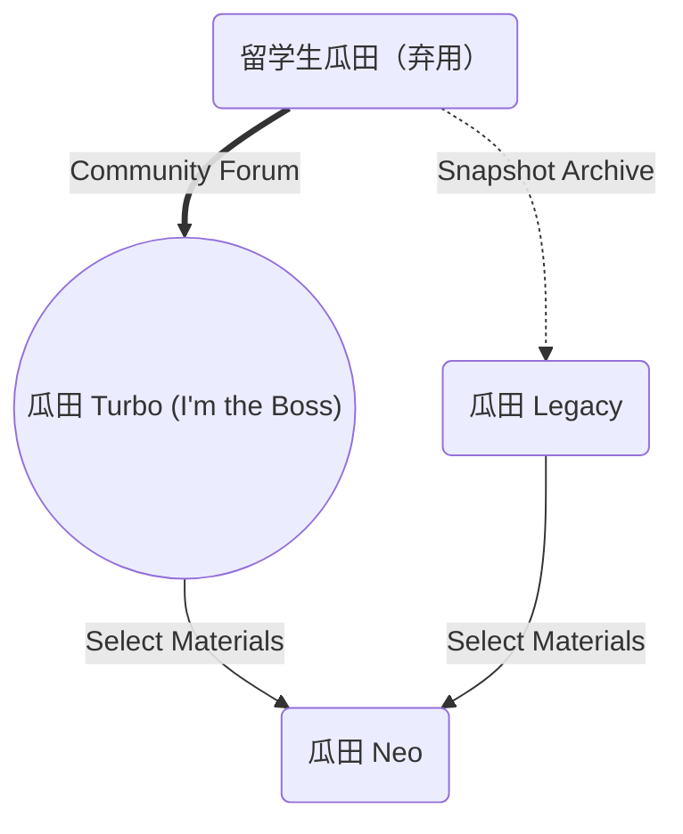

<!--more-->

## Introduction

What is the difference between "Gua Tian Neo" and "Gua Tian Turbo"? What happened to the original "Overseas Student Gua Tian" website?

The owner of "Overseas Student Gua Tian" decided to quit and released the following statement:

> ### Yes, I'm done. I'm tired.
> 
> When I started this website, I didn't even look at a single PDF. I just thought it would be fun to make a website for my friends to play around with.
> 
> The fact that it has received over one million visits in less than a week has changed everything.
> 
> Over the past few days, a variety of things have pushed me to the breaking point. Friends who wanted to develop the website together, people who wanted me to help them promote their own things, people who wanted to help me find ways to operate the website, people who wanted to submit articles, people who wanted to invest in the website, and people who wanted to offer advice. I haven't had time to stop and think about what this website is really doing.
> 
> The nature of this website means that during the wild growth process, the authenticity of the so-called "melons" cannot be guaranteed. The huge traffic inevitably causes completely unnecessary harm to both the people who are exposed and the people who are exposing them. As of now, more than ten people want to take down their PDFs because they have been troubled by the website.
> 
> Even if this website could grow into a stable forum with good traffic in the future, the use of privacy invasion and the growth of events involving large-scale gossip is something I cannot fully accept. Under the influence of traffic, the entire website has gradually deviated from my own values.
> 
> Therefore, after the second reconstruction of the website is completed and the comment and like functions are added, I still decided to permanently close the "Overseas Student Gua Tian" website. The community of more than two thousand people established will also be disbanded tonight, and the revenue from the website's only advertisement has already been returned. I apologize to everyone who may have been harmed. 

The speaker is currently working on revamping the website, and in the meantime, they have launched the original branch.

### Melon Field Neo

[**Melon Field Neo**](https://neo.schoolmelon.com/) is a branch version of Melon Field for international students. It is lightweight and concise, and all source code and project files are open. We have rewritten or are rewriting the posted content to achieve a better reading experience.


Currently, **Melon Field Neo** is undergoing a gray test and collecting feedback.


### Melon Field Turbo

[**Melon Field Turbo**](https://turbo.schoolmelon.net/) is our main business, a forum application. Any user can publish their own content, fully reflecting content diversity. At the same time, melon friends can also communicate their thoughts on eating melons, which is lacking in Neo.


Currently, **Melon Field Turbo** is undergoing a gray test and collecting feedback.


### Melon Field Legacy

[**Melon Field Legacy**](https://legacy.schoolmelon.com/) is a snapshot of the original Melon Field for international students. It has been discontinued and is only for commemoration.


Currently, **Melon Field Legacy** is still waiting.


## Relationship Diagram

## Vision

Our vision is not to promote social opposition or conflicts. For ordinary people, we hope that everyone can have the feeling of "at this moment, just like that moment" in the future, exercise our ability to see through social phenomena and explore the essence, or call it critical thinking.

For experts or scholars, we hope to provide sociological cases that can match abstract concepts with reality in academic research. What is valuable is that these cases are very timely and may provide different content from books.

For international students, you are the audience and participants of this collection. The people in it may be your colleagues. We hope to cultivate your ability to explore the essence and critical thinking.

## Improvements

We have rewritten most of the content in <u>[瓜田 Turbo](https://www.schoolmelon.net/)</u> and <u>[瓜田 Legacy](https://legacy.schoolmelon.com/)</u>, made improvements, and optimized the visual experience. At the same time, we have re-presented the content in the screenshots in the form of characters, making it more universal.

For some images, we use AI to enhance the visual experience.

For text, we use AI to proofread, rewrite, and split the original content, including format errors caused by copying.

For content, we have open-sourced all the code and documentation. If you are interested, you can even deploy your own clone locally. See the end of the article for details.

For performance, we use a lightweight, static [FixIt](https://github.com/hugo-fixit/FixIt) theme with [Hugo](https://gohugo.io/) architecture, which has extremely strong performance.

## Limitations

The verification of authenticity in this article is extremely limited, and can only rely on fast version control to promptly correct issues. Therefore, there is a risk of malicious exploitation, such as retaliation.

From a moral perspective, whether public moral judgments are acceptable to society is still controversial, and there are potential legal risks.

The sample size is limited, and the positioning is not a database, so the so-called function of avoiding pitfalls is completely unrealistic.

## Join Us

There are several ways for you to contribute, such as correcting errors and improving content.

### Submit Improvements

Our code is hosted on GitHub,

If you wish to submit changes, please submit a branch merge request in the form of a [Pull Request](https://github.com/JamesFlare1212/GOSSIP/pulls), rather than trying to submit a [Commit](https://github.com/JamesFlare1212/GOSSIP/commits/dev) directly to the main branch.

Translation:

### Correcting errors

If you need to correct any errors, you need to raise an [Issue](https://github.com/JamesFlare1212/GOSSIP/issues) in the repository of this project.

Before submitting a **PR** ([**P**ull **R**equest](https://github.com/JamesFlare1212/GOSSIP/pulls)), I hope you can fully discuss it in the [Issue](https://github.com/JamesFlare1212/GOSSIP/issues).

If you are the victim of rumors and defamation, don't worry. We will not tolerate this behavior, and we also have an obligation and responsibility to remove false information from the platform.

### Improving content

If you want to propose new ideas, I recommend that you post them in [Discussions](https://github.com/JamesFlare1212/GOSSIP/discussions) for discussion rather than raising an [Issue](https://github.com/JamesFlare1212/GOSSIP/issues) because it is not an error but an improvement.

If you have excellent content or know of high-quality sources, you are welcome to submit them.

### Submitting contributions

If you don't have the ability or time to rewrite a gossip like this directly, but only have similar PDF files or relevant links, but you still want to analyze and submit them, it is also possible. Go to the corresponding section of [Melon Field Turbo](https://www.schoolmelon.net/) and post a thread, and if possible, tag @James for better results.

You can also join the [Telegram group](https://t.me/schoolmelon) to submit your contributions.

### Form

If you have some ideas but do not want to discuss them in depth, you can use this form to provide feedback.

<iframe width="100%" height="480px" src="https://forms.office.com/Pages/ResponsePage.aspx?id=DQSIkWdsW0yxEjajBLZtrQAAAAAAAAAAAAN__jtRrTNUQURPOUpVMUFNRjhTUVRGRTVPNFBEVElBWi4u&embed=true" frameborder="0" marginwidth="0" marginheight="0" style="border: none; max-width:100%; max-height:100vh" allowfullscreen webkitallowfullscreen mozallowfullscreen msallowfullscreen> </iframe>

## Collaboration

You can contact us through jamesflare@schoolmelon.com to discuss collaboration opportunities. Please provide a brief introduction to the project and specify the details of the collaboration.

You can also contact us via Telegram ([@JamesFlareV2](https://t.me/JamesFlareV2)).

## Roadmap

### Processed

- [x] [UCSD - 颜宇琪（毒品、虐童、勒索）](/posts/uscd-yuqiyann/)
  - [x] ~~ucsd瓜.pdf~~
- [x] [UCSD - 罗骏哲 多次违法行为曝光](/posts/uscd-david/)
  - [x] ~~UCSD人渣软饭男，骗女生10余人，出轨pc偷钱偷包偷衣服虐猫蹭吃蹭住勾搭友妻刷室友信用卡借钱不还_纯图版.pdf~~
- [x] [NYU - 赵昱丞 六项不良行为曝光](/posts/nyu-andrew-zhao/)
  - [x] ~~纽约大学渣男赵昱丞六宗罪.pdf~~
- [x] [USYD - 王正太 租房、拍照欠款风波引发争议](/posts/usyd-zhen-taiwang/)
  - [x] ~~重生之我在悉尼大学立白富美人设当老赖.pdf~~
- [x] [YU - 陈俞健（家暴、虚伪、PUA）](/posts/usyd-zhen-taiwang/)
  - [x] ~~约克大学22管理系Riz陈俞健Npd人格家暴+伪富二代+PUA+精神控制 1.pdf~~
- [x] [UK - 陈邦瑞 时间管理能力超群](/posts/uk-chen-bangrui/)
  - [x] ~~英区新瓜：英国渣男陈邦瑞骗我感情的半年.pdf~~
  - [x] ~~埃克塞特_陈邦瑞.pdf~~
- [x] [UK - 佚名 多次骗人、出轨不断](/posts/uk-wzj/)
  - [x] ~~英区大瓜：重生之我在格拉斯哥当公交.pdf~~
- [x] [TUoS - 阚博文 聊骚、欠钱、分手诋毁](/posts/tuos-kan-bowen/)
  - [x] ~~谢菲SB男，KK聊骚，欠钱，分手诋毁.pdf~~
- [x] [USYD - 牛子战神 半夜牛牛攻击](/posts/usyd-genitalia-er/)
  - [x] ~~悉尼牛子战神传.pdf~~
- [x] [UoN - 谢俊 爱情经历与“明暗”情节](/posts/uon-xie-jun/)
  - [x] ~~诺丁汉谢俊事件详细记录.pdf~~
- [ ] [Soton - 孙*浩 英区没有爱情](/posts/soton-sun-mo-hao/)
  - [x] 南安普顿新瓜1.0版本.pdf
- [x] [KCL - 邢乐聪 涉嫌性骚扰 欺骗女性](/posts/kcl-xing-lecong/)
  - [x] ~~kcl骗炮渣男避雷.pdf~~
- [x] [NYU - 王子聪 多项指控（骗取、虐待、欺骗）](/posts/nyu-wang-zicong/)
  - [x] ~~nyu渣男王子聪.pdf~~
- [x] [UCSD - 绿帽哥 引发校园内部罗生门](/posts/uscd-oh-my-gosh/)
  - [x] ~~UCSD绿帽奴合集.pdf~~
- [x] [UoE - 张启航 不为人知的真相](/posts/uoe-vincent/)
  - [x] ~~爱丁堡下头装b男.pdf~~
- [x] [UQ - 布里斯班商科渣女的时间管理秘诀](/posts/uq-scape-merivale-girl/)
  - [x] ~~澳洲大瓜：布里斯班UQ04渣女在线教学如何成为时间管理大师.pdf~~
- [x] [UoB - 王田歌 网络欺凌、诽谤、肆意侵权](/posts/uob-wang-tiange/)
  - [ ] ~~伯明翰造谣王田歌.pdf~~

### Pending

- [x] ~~ucsd瓜.pdf~~
- [x] ~~UCSD人渣软饭男，骗女生10余人，出轨pc偷钱偷包偷衣服虐猫蹭吃蹭住勾搭友妻刷室友信用卡借钱不还_纯图版.pdf~~
- [x] ~~纽约大学渣男赵昱丞六宗罪.pdf~~
- [x] ~~重生之我在悉尼大学立白富美人设当老赖.pdf~~
- [x] ~~约克大学22管理系Riz陈俞健Npd人格家暴+伪富二代+PUA+精神控制 1.pdf~~
- [x] ~~英区新瓜：英国渣男陈邦瑞骗我感情的半年.pdf~~
- [x] ~~英区大瓜：重生之我在格拉斯哥当公交.pdf~~
- [x] ~~谢菲SB男，KK聊骚，欠钱，分手诋毁.pdf~~
- [x] ~~悉尼牛子战神传.pdf~~
- [x] ~~诺丁汉谢俊事件详细记录.pdf~~
- [x] 南安普顿新瓜1.0版本.pdf
- [x] 【悉尼er清算系列】网红预科泰勒出圈13秒视频，Waterfall高端公寓变身女子ufc决赛现场，背后真相突出一个离谱.pdf
- [x] ~~kcl骗炮渣男避雷.pdf~~
- [x] nyu渣男王子聪.pdf
- [x] ~~UCSD绿帽奴合集.pdf~~
- [x] ~~埃克塞特_陈邦瑞.pdf~~
- [x] ~~爱丁堡下头装b男.pdf~~
- [x] ~~澳洲大瓜：布里斯班UQ04渣女在线教学如何成为时间管理大师.pdf~~
- [x] ~~贝法王子录（七夕专供）.pdf~~
- [x] ~~伯明翰造谣王田歌.pdf~~
- [ ] 布里斯班大瓜：uq泰迪自称纯情男高，风骚半生归来仍是处男.pdf
- [ ] 澄清书.docx
- [ ] 抖音伦敦双胞胎网红.pdf
- [ ] 副本给大家安利悉尼北区某高中生书杯.pdf
- [ ] 高知千金 戏精附体 后续.pdf
- [ ] 格拉斯哥张进（恶臭公交男）1.pdf
- [ ] 回应下爱丁堡公主的“下头男pdf”xddd.pdf
- [ ] 剑桥地图炮（疾病防控）.pdf
- [ ] 伦敦避雷 天价ww按秒计费.docx
- [ ] 伦敦曼城：我可以你们不可以.pdf
- [ ] 伦敦徐州Lex张天瑜 欠债反叫债主穷酸”.pdf
- [ ] 曼城玫瑰花姐以及考文垂高智商男友+(1) (1).pdf
- [ ] 墨尔本DJ（mc）鸭子软饭硬吃三份pdf合订本.pdf
- [ ] 墨尔本DJ鸭子软饭硬吃pdf(1).pdf
- [ ] 女同快逃！避雷南安LES渣女-边PUA女友边出轨撩骚-.pdf
- [ ] 王婆刀鱼面 盗图行为恶劣.pdf